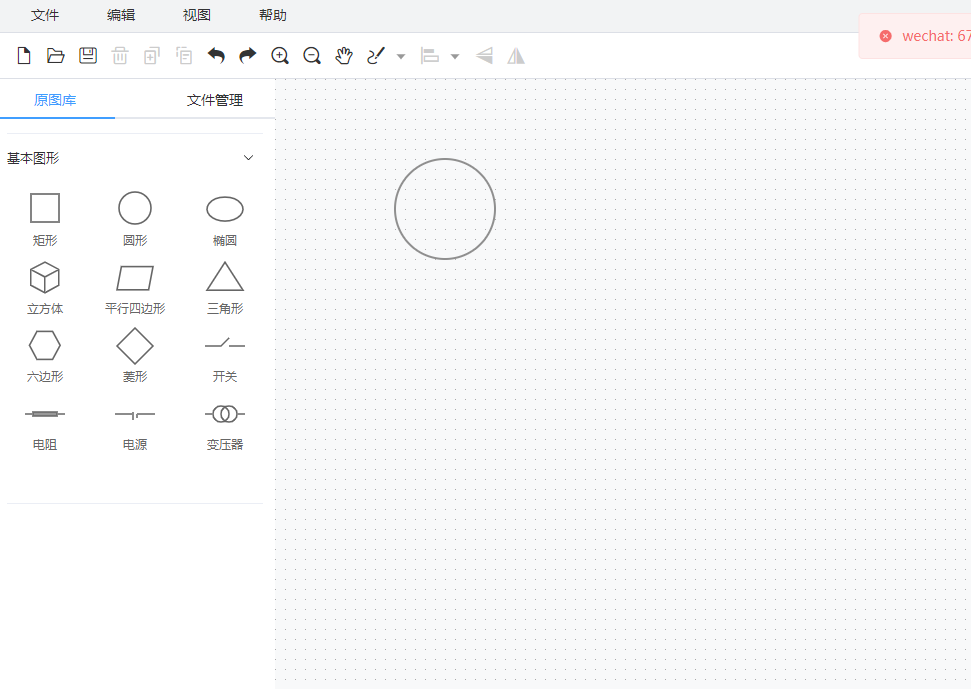

#Antv X6 + Vue 3 + TypeScript + Vite

This template should help get you started developing with Vue 3 and TypeScript in Vite. The template uses Vue 3 `<script setup>` SFCs, check out the [script setup docs](https://v3.vuejs.org/api/sfc-script-setup.html#sfc-script-setup) to learn more.

## Recommended IDE Setup

- [VS Code](https://code.visualstudio.com/) 

## Type Support For `.vue` Imports in TS

1. Command
   1. npm run i 
   2. npm run dev
2. 功能区预览

3.联系方式 WeChat： 676750993